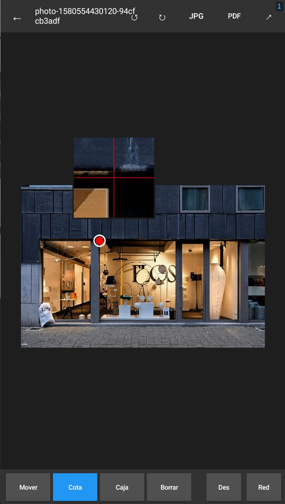
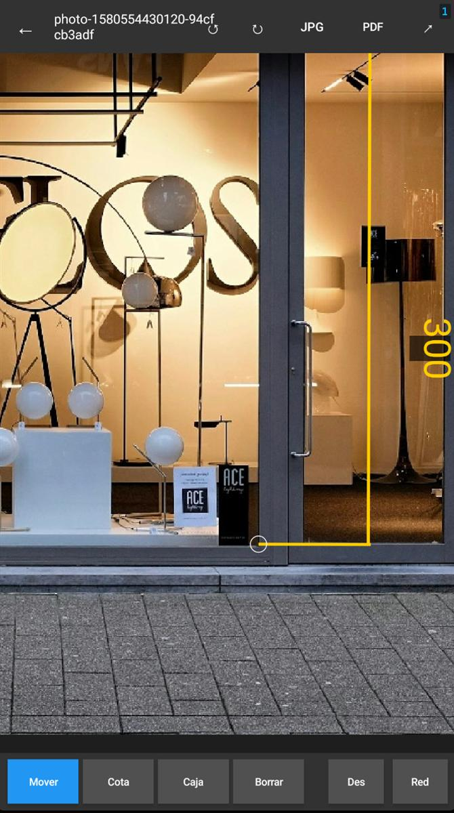
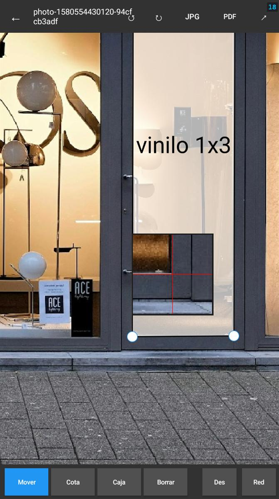
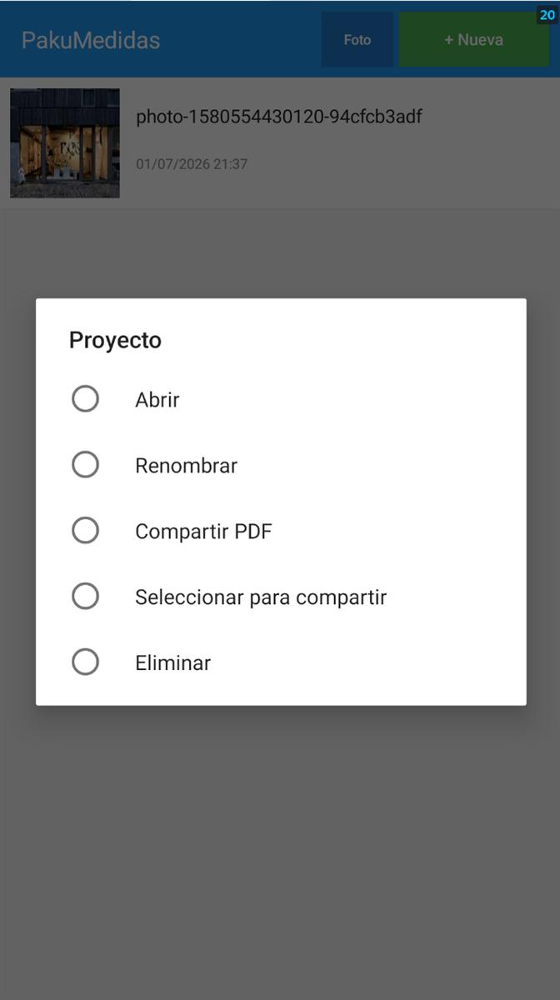

# PakuMedidas

🇬🇧 English README · 🇪🇸 [Versión en español](README.md)

Android app for annotating photos of building facades with dimension lines and free-form text boxes. Built for sign makers, installers, and technicians who need to document on-site measurements quickly.

---

## What it does

Take a photo of any facade or space and add professional annotations directly on top of it:

- **Dimension lines** — arrowed lines with an editable measurement value and adjustable offset
- **Text boxes** — labels with a semi-transparent background and 4 free corners (free-form shape, not just rectangles)
- **Export JPG** — annotated image at full resolution, ready to send
- **Export vector PDF** — dimension lines and boxes as vectors (not raster), crisp at any zoom level
- **Share** — direct send via WhatsApp, email, or any app

---

## Features

| | |
|---|---|
| Precision magnifier | 4× panel while placing dimension points |
| Zoom / Pan | Pinch to zoom + single-finger pan |
| Drag everything | Endpoints, dimension text, line offset, box corners |
| Undo / Redo | 30-step history |
| Colors | Color picker for dimensions and boxes |
| Projects | List with thumbnail, rename, duplicate, delete |
| Offline | No servers, no internet, works 100% locally |

---

## Screenshots

<table>
<tr>
<td></td>
<td></td>
<td></td>
<td></td>
</tr>
<tr>
<td align="center">Precision magnifier while placing a dimension</td>
<td align="center">Dimension line with 90° rotated text</td>
<td align="center">Free-form text box</td>
<td align="center">Project list and sharing</td>
</tr>
</table>

---

## Requirements

- Android 5.0 (API 21) or higher
- Permissions: `READ_MEDIA_IMAGES` (gallery), `WRITE_EXTERNAL_STORAGE` (Android < 10)

---

## Download

The APK is on the [GitHub releases page](https://github.com/unmateria/pakuMedidas/releases/latest). Download it, enable "unknown sources" if your device asks, and install it.

---

## Build from source

Requires [Basic4Android (B4A)](https://www.b4x.com/b4a.html) v13.3 or higher.

### Required libraries

Install from the B4A Library Manager:
`core`, `xui`, `phone`, `gestures`, `sql`, `json`, `javaobject`

### Build with B4ABuilder (PowerShell)

```powershell
$iniPath  = "$env:APPDATA\Anywhere Software\Basic4android\b4xV5.ini"
$builder  = "C:\Program Files\Anywhere Software\B4A\B4ABuilder.exe"
$folder   = $PSScriptRoot

$psi = New-Object System.Diagnostics.ProcessStartInfo
$psi.FileName = $builder
$psi.Arguments = "-Task=Build -BaseFolder=""$folder"" -Project=""pakumedidas.b4a"" -Obfuscate=False -ShowWarnings=True -INI=""$iniPath"""
$psi.WorkingDirectory = $folder
$psi.RedirectStandardOutput = $true
$psi.RedirectStandardError  = $true
$psi.UseShellExecute = $false
$p = [System.Diagnostics.Process]::Start($psi)
$p.StandardOutput.ReadToEnd()
$p.WaitForExit(120000)
```

Output APK: `Objects\pakumedidas.apk`

### Install on device

```bash
adb install -r Objects\pakumedidas.apk
```

---

## Quick start

1. Tap **+ New** and select a photo from the gallery
2. Choose the **Dimension** tool and tap two points on the photo — use the magnifier for precision
3. Type the measurement (e.g. `385 cm`) and tap OK
4. Drag the endpoints, the text, or the line to adjust the dimension
5. Choose **Box** to add text labels with free-form corners
6. Tap **PDF** to export or **↗** to share directly

---

## Project structure

```
pakumedidas.b4a     — Main activity + all UI logic
Starter.bas         — Startup service + SQLite database
CotaEngine.bas      — Dimensions/boxes engine: data, rendering, hit-test
PdfExporter.bas     — Native vector PDF export (android.graphics.pdf)
```

---

## License

PolyForm Noncommercial 1.0.0 + reciprocity clause — see [LICENSE.md](LICENSE.md).

Free for noncommercial use. Commercial use of the original or any derivative requires the author's explicit written permission. If you distribute a modified version, it must remain open under this same license.
